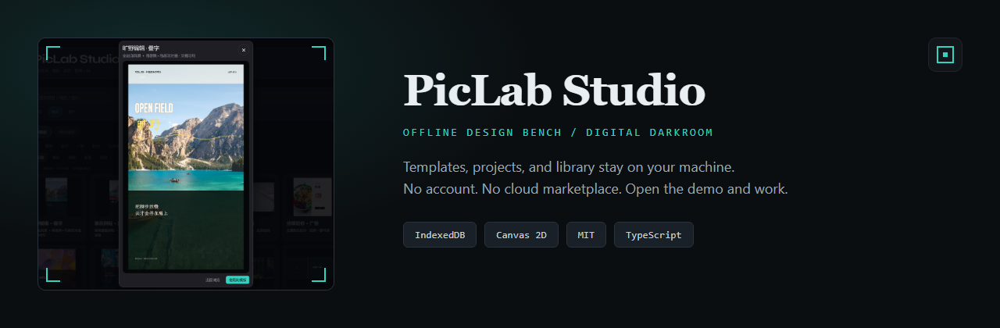
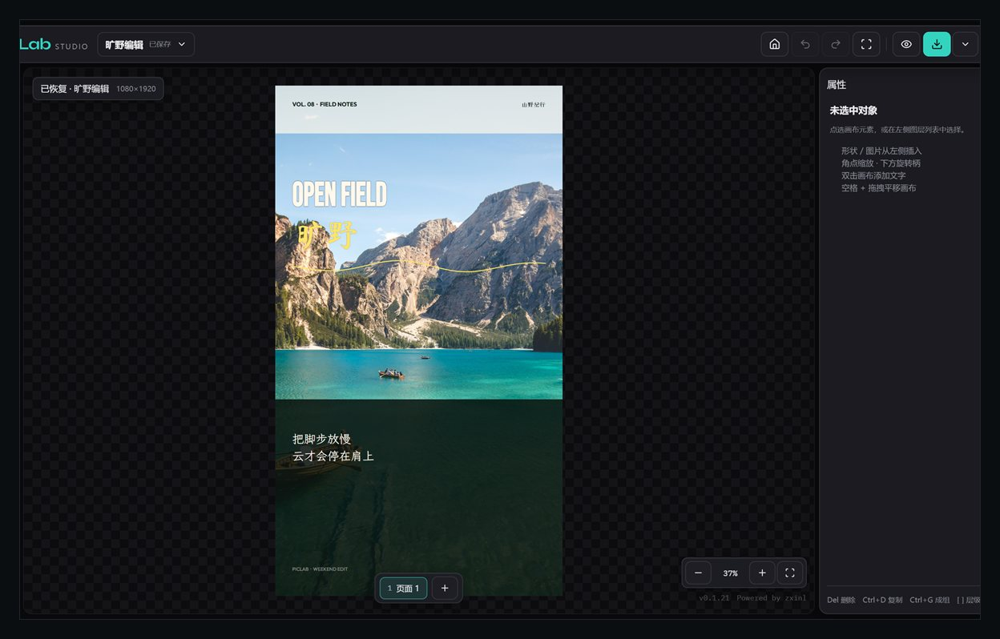
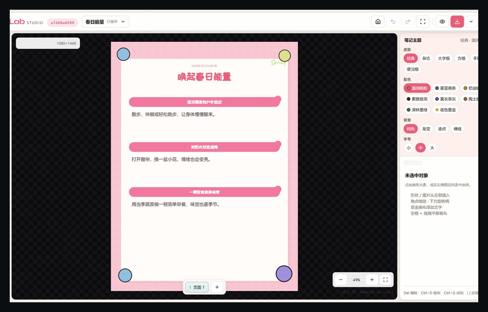
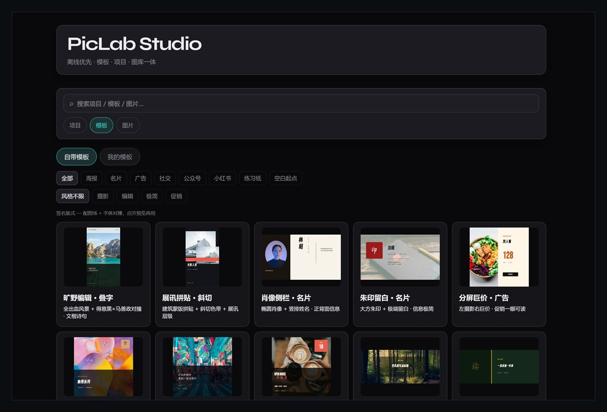
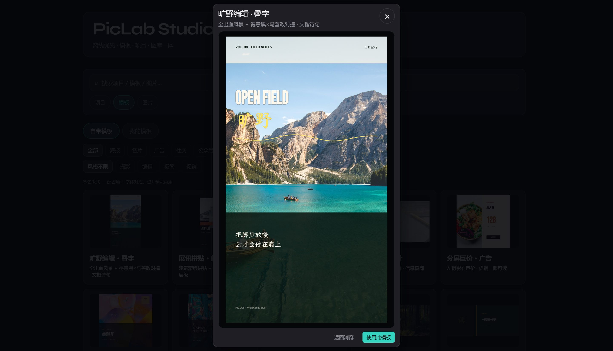
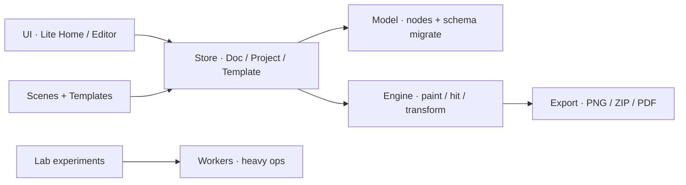

<p align="center">
  
</p>

<p align="center">
  <strong>Offline-first</strong> browser design bench &amp; digital darkroom.<br/>
  Templates · projects · library stay on <em>your</em> machine — not in a cloud marketplace.
</p>

<p align="center">
  <a href="https://marsresearcher.github.io/piclab/"></a>
  <a href="https://github.com/MarsResearcher/piclab/releases/tag/v0.1.21"></a>
  <a href="LICENSE"></a>
  
  
  
</p>

<p align="center">
  浏览器里的设计工作台与图像暗房 · <strong>离线优先</strong> · 打开 <a href="https://marsresearcher.github.io/piclab/">在线演示</a> 即可用，无需账号
</p>

---

## Why PicLab (not another SaaS editor)

| Principle | What you get |
| --- | --- |
| **Your data stays local** | Projects & user templates in IndexedDB — close the tab, work resumes |
| **Templates are documents** | Decomposable nodes (type / image / shape / group) — not locked SKUs |
| **Studio → Lab** | Layout & type in Studio; optional free pixel experiments in Lab |
| **China-native scenes** | 小红书 · 公众号 · 手账壳 · 田字格 / 拼音格 / 书法格 |

Built for people who want a **local design bench**, not another subscription canvas.

---

## Try it in 60 seconds

**→ [https://marsresearcher.github.io/piclab/](https://marsresearcher.github.io/piclab/)** · Chromium / Firefox / Safari · no signup

```bash
git clone https://github.com/MarsResearcher/piclab.git
cd piclab && npm install && npm run dev
```

| Check | Command |
| --- | --- |
| Offline critical path | `npm run smoke` |
| Typecheck + production | `npm run build` |

Full walkthrough: [`docs/getting-started.md`](docs/getting-started.md).

---

## Product tour

**Studio** — edit on canvas, export when ready.

<p align="center">
  
</p>

**Xiaohongshu in edit mode** — journal shell + theme controls (beachhead scene).

<p align="center">
  
</p>

**Lite Home** finds work · **Preview** before you commit.

| Find a template | Preview, then use |
| :---: | :---: |
|  |  |

Flow: preview → **使用此模板** → edit → **导出** PNG / ZIP / PDF.

---

## Capabilities

- **L1 builtins** — signature layouts in `src/studio/templates/` (poster, card, ad, social, WeChat, XHS, …)
- **L2 scenes** — parameterized canvases (`card` / `poster` / `ad` / `social` / `wechatCover` / `xhsNote` / print grids)
- **L3 my templates** — 「另存为模板」 → local `templateStore`
- **Export** — page PNG, multi-page ZIP, PDF (optional bleed)
- **Print** — A4 田字格 / 拼音格 / 书法格, offline geometry
- **Stock + stickers** — bundled photos + Lucide / Open Doodles chrome
- **Lab** — free pixel playground (FFT, convolution, pixel sort, channel remap, …); same app, no paywall

---

## Architecture



UI talks to **stores & plugins only** — never raw pixels for document edits.

```
model/ → store/ → engine/ → plugins/ → scenes/ + templates/ → export/
UI: src/ui/studio/
```

Details: [`src/studio/ARCHITECTURE.md`](src/studio/ARCHITECTURE.md) · Contributor map: [`docs/getting-started.md`](docs/getting-started.md).

---

## Lab

Optional **free** pixel playground behind Studio (same offline app — no account, no paid tier):

1. Copy `src/experiments/template.ts`
2. Implement `id / name / params / apply(imageData, params)`
3. Register in `src/core/experimentRegistry.ts`

---

## Tech stack

React 19 · TypeScript 5 · Vite 6 · Canvas 2D · IndexedDB · Web Workers (heavy ops)

---

## Contributing

Read [`CONTRIBUTING.md`](CONTRIBUTING.md) and [`CODE_OF_CONDUCT.md`](CODE_OF_CONDUCT.md).

Product direction: [`docs/PRODUCT.md`](docs/PRODUCT.md).

- Prefer small, reviewable PRs
- UI changes: include a screenshot or short clip
- Keep offline-first — no required cloud backend for core Studio

Security: [`SECURITY.md`](SECURITY.md) — **do not** file public issues for vulnerabilities.

---

## Roadmap

| Now | Next |
| --- | --- |
| Public demo + MIT + releases | Green CI badge (needs `workflow` OAuth push) |
| Journal「手账壳」+ project covers | Short product GIF / motion tour |
| Product consensus (`docs/PRODUCT.md`) | Learn from real Xiaohongshu creator usage |
| Smoke + architecture docs | Bilingual docs polish; good-first-issues |
| Contributor Covenant | Community growth → more governance as needed |

See [`CHANGELOG.md`](CHANGELOG.md) and [v0.1.21](https://github.com/MarsResearcher/piclab/releases/tag/v0.1.21).

---

## License

[MIT](LICENSE) © 2026 MarsResearcher / PicLab contributors.

Bundled fonts & illustrations keep their own licenses — `public/**/CREDITS.md`, `public/fonts/OFL-NOTICE.txt`.

---

<p align="center">
  <sub>English docs · Chinese UI · PRs welcome for bilingual improvements</sub>
</p>
